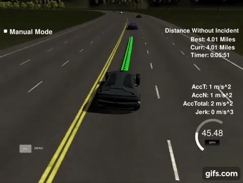

# Path Planning Project



This project implements a path planner designed to generate smooth and safe trajectories for a self-driving car operating in a simulated highway environment.

## Project Goals

The primary objective is to enable the autonomous vehicle to navigate a virtual highway safely and efficiently alongside other traffic. Key goals include:

*   **Maintain Speed:** Drive as close as possible to the 50 MPH speed limit.
*   **Overtake Safely:** Change lanes to pass slower vehicles when it's safe and advantageous.
*   **Collision Avoidance:** Avoid collisions with other vehicles under all circumstances, including during lane changes initiated by other cars.
*   **Lane Discipline:** Stay within marked lane boundaries at all times, except when executing a lane change.
*   **Endurance:** Complete a full lap of the ~6946m highway loop (approx. 5 minutes at target speed).
*   **Ride Comfort:** Ensure smooth driving by limiting total acceleration to below 10 m/s² and jerk to below 10 m/s³.

## How the Path Planner Works

### Input Data

The planner utilizes the following information provided by the simulator:

*   **Ego Vehicle State:** Localization data (position, orientation) and speed of our self-driving car.
*   **Sensor Fusion:** Localization and velocity data for other vehicles detected on the road.
*   **Map Data:** A sparse list of waypoints defining the center line of the highway.

### Output Trajectory

In each execution cycle, the path planner generates a list of 50 future points (`x`, `y` coordinates in the global map frame). These points define the planned trajectory for the car to follow.

*   **Smooth Transitions:** To ensure continuity, the planner reuses any waypoints from the *previous* cycle's trajectory that the car hasn't reached yet. It then calculates and appends new waypoints to reach the total of 50. This prevents abrupt changes in motion.
*   **Output Variables:** In the `main.cpp` code, the generated trajectory points are stored in `next_x_vals` and `next_y_vals` before being sent to the simulator. The unused points from the previous plan are provided in `previous_path_x` and `previous_path_y`.

### Key Planning Considerations

*   **Safe Lane Changing:**
    *   When approaching a slower vehicle ahead, the planner reduces speed.
    *   It evaluates potential lane changes based on safety (checking for nearby cars in the target lane) and efficiency (whether the change allows for faster progress).
    *   A cost function helps determine the optimal lane by considering the distance and speed of the nearest vehicles in adjacent lanes.

*   **Smoothness & Latency:**
    *   There's a small delay (latency) between when the planner calculates a path and when the simulator acts on it.
    *   The planner accounts for this by ensuring the newly generated path smoothly connects with the portion of the previous path the car is still following.

*   **Jerk Minimization:**
    *   To meet the acceleration and jerk constraints for passenger comfort, the planner adjusts the spacing between trajectory points.
    *   It gradually increases spacing to accelerate and decreases spacing to decelerate, based on the target `car_speed`.

## Simulator Environment

### Vehicle Data (`sensor_fusion`)

The simulator provides information about other cars via the `sensor_fusion` variable. Each entry represents one vehicle and follows this format:

`[id, x, y, vx, vy, s, d]`

*   `id`: Unique identifier for the car.
*   `x`, `y`: Global map coordinates (meters).
*   `vx`, `vy`: Velocity components in map coordinates (m/s).
*   `s`, `d`: Frenet coordinates (longitudinal and lateral distance along the road).
    *(Note: This data is provided without simulated sensor noise.)*

### Highway Specifications

*   **Map File:** The highway layout is defined by waypoints in `data/highway_map.csv`. These waypoints mark the center of the double-yellow line.
*   **Track Length:** The total track length is 6945.554 meters.
*   **Lanes:** The highway has 3 lanes in each direction (6 total). Each lane is 4 meters wide.
*   **Driving Side:** The self-driving car operates in the 3 lanes on the right-hand side of the road.

## Result Demonstration

Watch a video of the path planner navigating the simulated highway by clicking the image below:

---

## Basic Build Instructions

1.  **Clone the repository:**
    ```bash
    git clone <repository_url>
    cd <repository_directory>
    ```
2.  **Create a build directory:**
    ```bash
    mkdir build && cd build
    ```
3.  **Compile the project:**
    ```bash
    cmake .. && make
    ```
4.  **Run the executable:**
    ```bash
    ./path_planning
    ```

---

## Data Exchange with Simulator

The C++ application receives the following data from the simulator:

#### Main Car's Localization Data

*   `["x"]`: Car's x position (map coordinates)
*   `["y"]`: Car's y position (map coordinates)
*   `["s"]`: Car's s position (Frenet coordinates)
*   `["d"]`: Car's d position (Frenet coordinates)
*   `["yaw"]`: Car's yaw angle (map coordinates, degrees)
*   `["speed"]`: Car's speed (MPH)
    *(Note: This data is noise-free.)*

#### Previous Path Data

*   `["previous_path_x"]`: List of x points from the *previous* trajectory sent to the simulator (consumed points are removed).
*   `["previous_path_y"]`: List of y points from the *previous* trajectory sent to the simulator (consumed points are removed).

#### Previous Path's End Point

*   `["end_path_s"]`: The s coordinate of the last point in the previous path.
*   `["end_path_d"]`: The d coordinate of the last point in the previous path.

#### Sensor Fusion Data

*   `["sensor_fusion"]`: A list of lists. Each inner list contains data for one detected vehicle on the same side of the road: `[id, x, y, vx, vy, s, d]`.
    *(Note: This data is noise-free.)*

---

## Dependencies

*   **cmake** >= 3.5 ([Installation Guide](https://cmake.org/install/))
*   **make** >= 4.1
    *   Linux: Usually pre-installed.
    *   Mac: Install Xcode command line tools ([Xcode Features](https://developer.apple.com/xcode/features/))
    *   Windows: Recommended via [MinGW Make](http://gnuwin32.sourceforge.net/packages/make.htm)
*   **gcc/g++** >= 5.4
    *   Linux: Usually pre-installed.
    *   Mac: Install Xcode command line tools ([Xcode Features](https://developer.apple.com/xcode/features/))
    *   Windows: Recommended via [MinGW](http://www.mingw.org/)
*   **uWebSockets**
    *   Run the appropriate installation script (`install-mac.sh` or `install-ubuntu.sh`) included in the project or repository this README belongs to (if applicable).
    *   Alternatively, install from source, ensuring you check out commit `e94b6e1`:
        ```bash
        git clone https://github.com/uWebSockets/uWebSockets
        cd uWebSockets
        git checkout e94b6e1
        # Follow uWebSockets build instructions (cmake, make install)
        ```

### Trajectory Generation Tool

*   **Spline Library:** A lightweight C++ spline library ([link](https://kluge.in-chemnitz.de/opensource/spline/)) contained in `spline.h` is used to interpolate points and create smooth curves between waypoints for the final trajectory.

---

## Simulator

The required simulator environment can be downloaded from the Udacity Self-Driving Car Nanodegree releases:
[Download Simulator (Term 3, v1.2)](https://github.com/udacity/self-driving-car-sim/releases/tag/T3_v1.2)